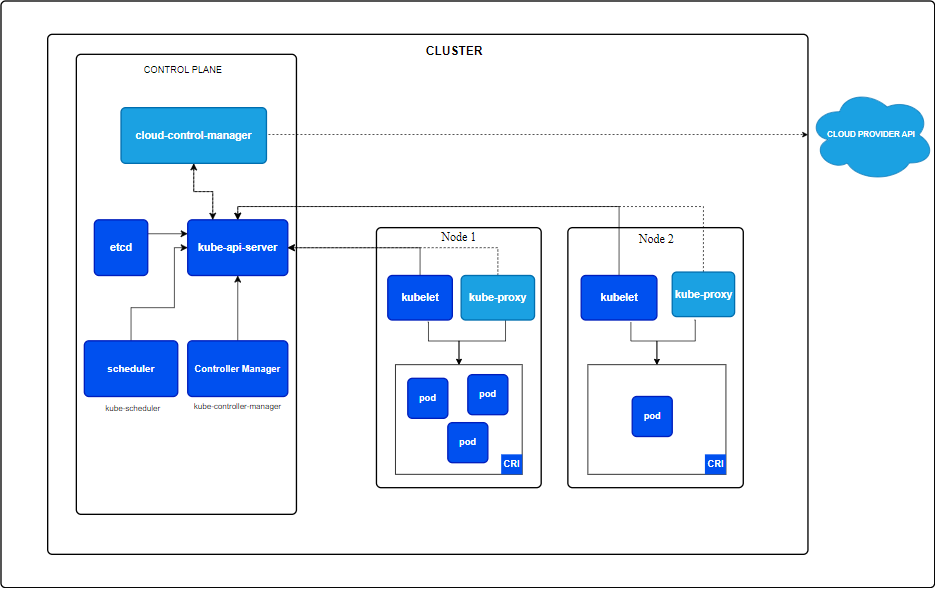

## Kubernetes (K8s) Architecture




### Kubernetes (K8s)
- **Cluster**: The entire Kubernetes system managing containerized applications.

#### 1. **Control Plane**
   - **API Server**: 
     - Central management point where `kubectl` commands and other client requests interact with the cluster.
     - Handles requests, authentication, authorization, and routing.
   - **Scheduler**: 
     - Decides which worker node will run each pod based on resource availability.
   - **Controller Manager**: 
     - Maintains the desired state of the cluster by managing controllers (e.g., Replication Controller, Deployment Controller).
   - **etcd**: 
     - Distributed key-value store that holds all configuration and state data for the Kubernetes cluster.

#### 2. **Nodes**
   - **Worker Nodes**: 
     - Hosts and runs containerized applications.
     - Contains:
       - **Kubelet**: 
         - Ensures containers are running as specified and manages the lifecycle of pods on the node.
       - **Kube-Proxy**: 
         - Manages network routing and load balancing to expose services within the cluster.
       - **Container Runtime**: 
         - Runs and manages containerized applications (e.g., Docker, containerd).

#### 3. **Pods**
   - **Containers**: 
     - Runs application instances within the pods.
   - **Volumes**: 
     - Provides persistent storage to containers within a pod.

#### 4. **Services**
   - **ClusterIP**: 
     - Provides internal access to services within the cluster.
   - **NodePort**: 
     - Exposes services on a static port across all nodes, allowing external access.
   - **LoadBalancer**: 
     - Automatically provisions an external load balancer to distribute traffic to services.

### High-Level Tree Format

```plaintext
Kubernetes (K8s)
   ├── Cluster
   │   ├── Control Plane
   │   │   ├── API Server
   │   │   ├── Scheduler
   │   │   ├── Controller Manager
   │   │   └── etcd
   │   └── Nodes
   │       ├── Worker Nodes
   │       │   ├── Kubelet
   │       │   ├── Kube-Proxy
   │       │   └── Container Runtime
   │       │       └── Containers
   │       │           └── Volumes
   └── Services
       ├── ClusterIP
       ├── NodePort
       └── LoadBalancer
